## 5.1.1 CPU功能

**组成：** 控制器、运算器、寄存器

**功能：** 指令控制、操作控制、时间控制、数据加工。

## 5.1.2 CPU 的基本组成

本章以 **CPU 执行指令** 为主线，给出如下图 5.1 所示的 CPU 简化模型。

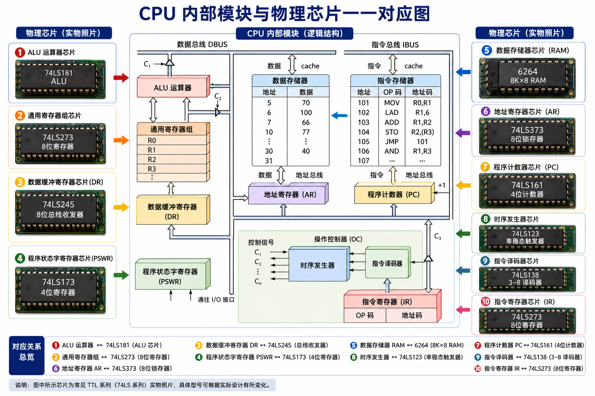

---

###  控制器 (Controller) — 决策机构
> 负责发布命令，完成协调和指挥整个计算机系统的操作。

*   **内部组成**：程序计数器 (PC)、指令寄存器 (IR)、指令译码器 (ID)、时序产生器和操作控制器。
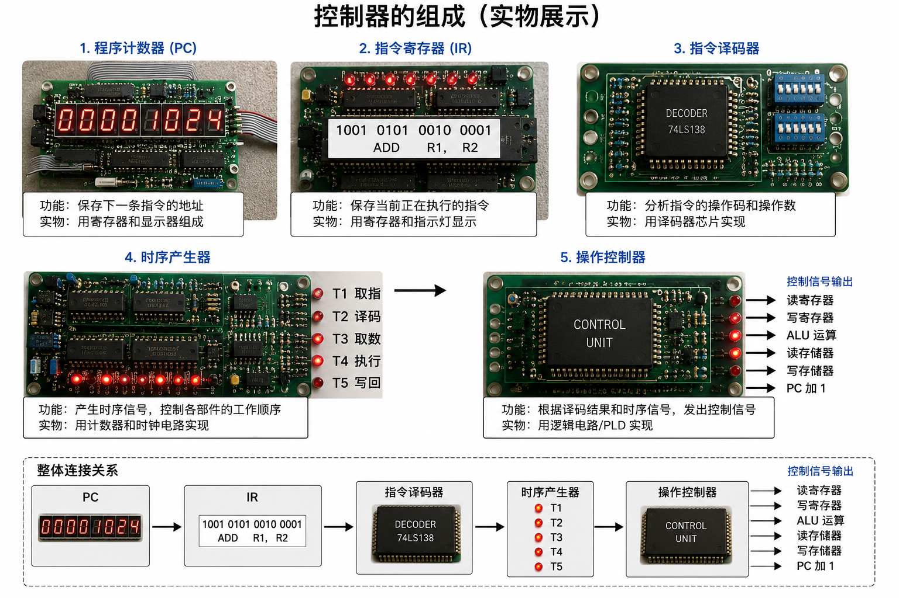
*   **主要功能**：
    1.  **取指令**：从指令 Cache 中取出一条指令，并指出下一条指令在 Cache 中的位置。
    2.  **译码与控制**：对指令进行译码，产生相应的操作控制信号（如 Cache 读写、ALU 运算、I/O 操作等）。
    3.  **数据流控制**：指挥并控制 CPU、数据 Cache 和 I/O 设备之间的数据流动方向。

###  运算器 (Arithmetic Logic Unit) — 执行部件
> 负责数据加工处理。接受控制器的命令而进行动作，全部操作均由控制器指挥。

*   **内部组成**：算术逻辑运算单元 (ALU)、通用寄存器、数据缓冲寄存器 (DR) 和程序状态字寄存器 (PSWR)。
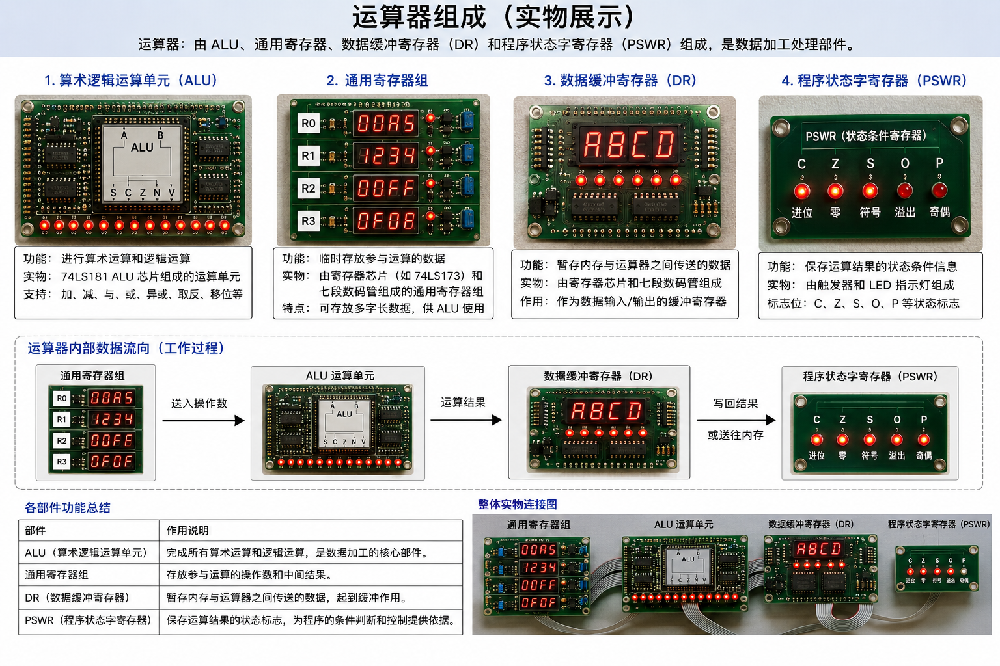
*   **主要功能**：
    1.  **执行算术运算**：进行加、减、乘、除等所有算术操作并产生结果。
    2.  **执行逻辑运算**：进行逻辑测试（如零值测试、比较两个值等）并产生判决。

## 5.2 指令周期

### 5.2.1 指令周期的基本概念
> **指令和数据从形式上看都是二进制代码，CPU如何区分它们的？**
> **解答**：CPU 是根据 **执行阶段（时间）** 来判别的。在**取指阶段**从内存取出的二进制代码是**指令**；在**执行阶段**从内存取出的二进制代码是**数据**。（后面有详细讲解）

> **指令周期：** 指CPU从内存中读取并执行一条指令所需的时间。  
> **CPU周期：** 又称为机器周期，是指从内存中读取一个指令字的最短时间  
> **时钟周期：** 又称 T 周期或节拍脉冲，它是处理操作的最基本单位 
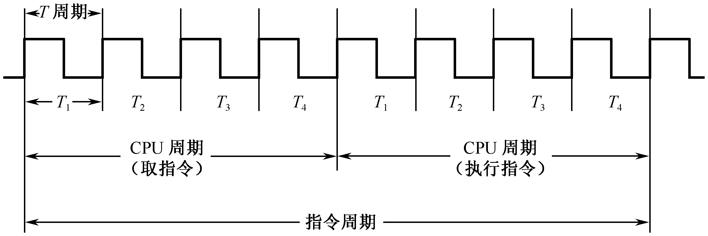

### 5.2.2 NOT 指令的指令周期
####  符号说明

| 符号 | 含义 | 符号 | 含义 |
| :--- | :--- | :--- | :--- |
| **PC** | 程序计数器 | **IR** | 指令寄存器 |
| **ID** | 指令译码器 | **OC** | 操作控制器 |
| **ALU** | 算术逻辑运算单元 | **DR** | 数据缓冲寄存器 |
| **AR** | 数存地址寄存器 | **PSWR** | 程序状态字寄存器 |
| **R0 / R1 / R2** | 通用寄存器 | **OP** | 操作码字段 |
| **DBUS** | 数据总线 | **IBUS** | 指令总线 |
| **ABUS(I)** | 指存地址总线 | **ABUS(D)** | 数存地址总线 |
| **RD(I)** | 指存读命令 | **RD(D)** | 数存读命令 |
| **WE(D)** | 数存写命令 | **～** | 公操作符号 |

---
NOT 是一条 **RR 型指令**（寄存器-寄存器），其指令周期由 **2 个 CPU 周期** 组成：

| 阶段 | 占用 | 任务 |
| :--- | :--- | :--- |
| **取指周期** | 1 个 CPU 周期 | 取指令、PC+1、译码 |
| **执行周期** | 1 个 CPU 周期 | 将 R1 取反后送入 R0 |
---

#### 1. 取指周期

> 目标：从指存中取出 NOT 指令，并为取下一条指令做准备。
1. **PC ← 101**：程序计数器装入第一条指令地址 101
2. **ABUS(I) ← PC**：PC 的内容放到指令地址总线上，对指存进行译码并启动读命令
3. **IR ← [101]**：从 101 号地址读出的 NOT 指令通过指令总线 IBUS 装入指令寄存器 IR
4. **PC ← PC + 1**：程序计数器加 1，变成 102，为取下一条指令做好准备
5. **译码 OP**：指令寄存器中的操作码被译码
6. **识别指令**：CPU 识别出是 NOT 指令 → 取指周期结束 ✅
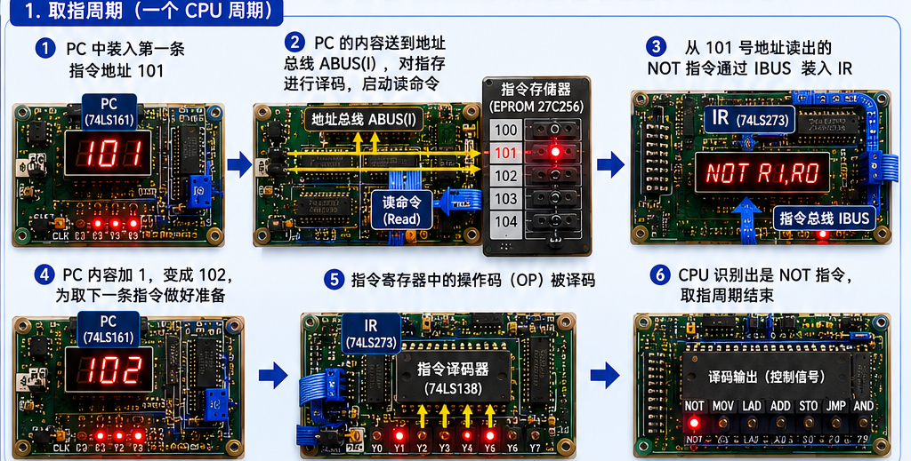
---

#### 2. 执行周期

> 目标：将 R1 的值取反后送入 R0。
1. **选中源寄存器**：OC 根据 IR 中源寄存器字段的地址编码，选中 **R1** 为源寄存器
2. **ALU 取反**：OC 发出控制信号到 ALU，指定 ALU 做 **取反操作**
3. **ALU → DBUS**：OC 打开 ALU 输出三态门，将结果送到数据总线 DBUS 上
   > ⚠️ 任何时候 DBUS 上只能有一个数据！
4. **DBUS → DR**：OC 将 DBUS 上的数据打入数据缓冲寄存器 DR（值为 245）
5. **DR → R0**：OC 根据 IR 中目标寄存器字段的地址编码选中 **R0** 为目标寄存器，将 DR 中的数据 245 打入 R0
   - R0 的内容由 `00` → `245` → 执行结束 ✅

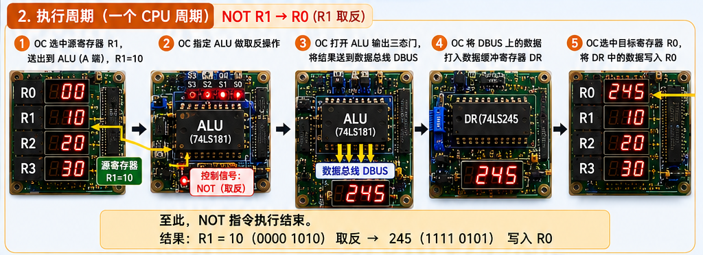

#### 3. 总体流程图
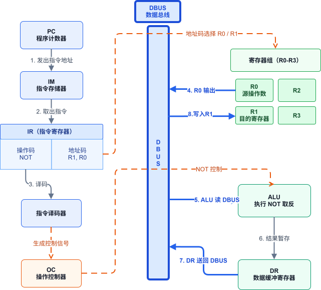

### 5.2.3 LAD 指令的指令周期

LAD 是一条 **RS 型指令**（寄存器-存储器），需要先访问**指存**取指令，再访问**数存**取数据，其指令周期由 **3 个 CPU 周期** 组成：

| 阶段 | 占用 | 任务 |
| :--- | :--- | :--- |
| **取指周期** | 1 个 CPU 周期 | 取指令、PC+1、译码 |
| **执行周期** | 2 个 CPU 周期 | 间址（送地址）+ 取数（读数据装入 R1） |

>  **为什么执行周期要 2 个 CPU 周期？** 因为 DBUS 上需要**分时**完成两件事：先传地址，再传数据，不能同时进行。

---

#### 1. 取指周期

> 目标：从指存中取出 LAD 指令（流程与 NOT 取指完全相同故省略）。
#### 2. 执行周期

> 目标：从数存 6 号单元取出数据 100，装入通用寄存器 R1。

#####  第一个 CPU 周期 — 间址阶段（传地址）

1. **IR → DBUS**：OC 打开 IR 输出三态门，将指令中的直接地址码 `6` 放到 DBUS 上
2. **DBUS → AR**：OC 将地址码 6 装入数存地址寄存器 AR

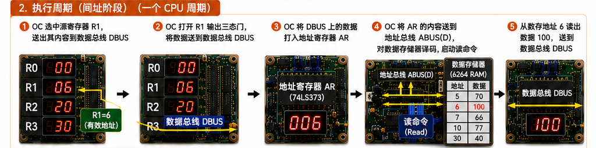

#####  第二个 CPU 周期 — 取数阶段（传数据）

3. **[6] → DBUS**：OC 发出读命令，将数存 6 号单元中的数据 `100` 读出到 DBUS 上
4. **DBUS → DR**：OC 将 DBUS 上的数据 100 装入缓冲寄存器 DR
5. **DR → R1**：OC 根据 IR 中目标寄存器字段选中 **R1** 为目标寄存器，将 DR 中的数据 100 装入 R1
   - R1 的内容由 `10` → `100`（原数据被冲掉）→ 执行结束 ✅

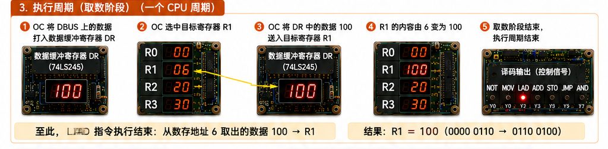

#### 3. 总体流程图
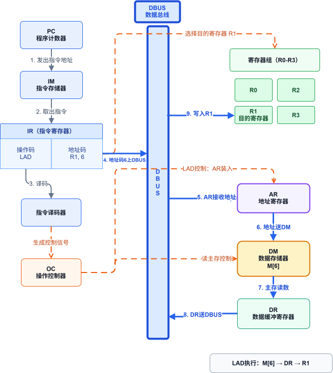

### 5.2.4 ADD 指令的指令周期

ADD 是一条 **RR 型指令**（寄存器-寄存器），将 R0 与 R1 的值相加，结果存入 R2，其指令周期由 **2 个 CPU 周期** 组成：

| 阶段 | 占用 | 任务 |
| :--- | :--- | :--- |
| **取指周期** | 1 个 CPU 周期 | 取指令、PC+1、译码 |
| **执行周期** | 1 个 CPU 周期 | 读 R0、R1 → ALU 相加 → 结果写入 R2 |

>  ADD 与 NOT 一样都是 RR 型，操作数全在寄存器中，无需访问数存，因此执行周期只需 **1 个 CPU 周期**。

---

#### 1. 取指周期

> 目标：从指存中取出 ADD 指令（流程与前述取指完全相同）。
1. **PC ← 103**：程序计数器提供指令地址 103
2. **ABUS(I) ← PC**：PC 内容放到指令地址总线上，对指存译码并启动读命令
3. **IR ← [103]**：从 103 号地址读出 `ADD R2, R0, R1` 指令，通过 IBUS 装入 IR
4. **PC ← PC + 1**：程序计数器加 1，变成 104，为取下条 STO 指令做好准备
5. **译码 OP**：指令寄存器中的操作码被译码
6. **识别指令**：CPU 识别出是 ADD 指令 → 取指周期结束 ✅

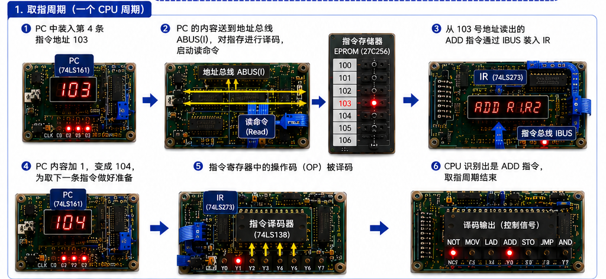

---

#### 2. 执行周期

> 目标：将 R0 + R1 的结果写入 R2。

#####  步骤一 — 读取源寄存器

1. **选中 R0、R1**：OC 根据 IR 中源寄存器字段的地址编码，选中 **R0** 和 **R1** 为源寄存器，将它们的值送到 ALU 的两个输入端

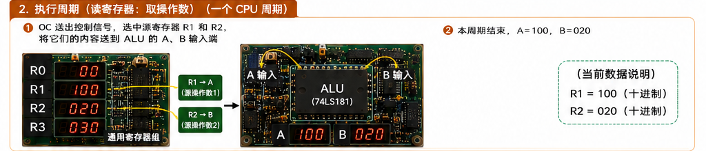

#####  步骤二 — ALU 运算

2. **ALU 加法**：OC 发出控制信号到 ALU，指定 ALU 做 **加法操作**，计算 R0 + R1 = `245 + 100 = 345`

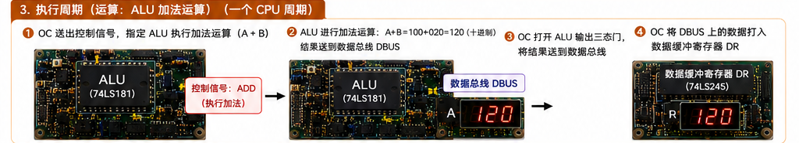

#####  步骤三 — 写回结果

3. **ALU → DBUS**：OC 打开 ALU 输出三态门，将运算结果 `345` 送到 DBUS 上
4. **DBUS → DR**：OC 将 DBUS 上的数据 345 装入缓冲寄存器 DR
5. **DR → R2**：OC 根据 IR 中目标寄存器字段选中 **R2** 为目标寄存器，将 DR 中的数据 345 装入 R2
   - R2 的内容由 `00` → `345` → 执行结束 ✅

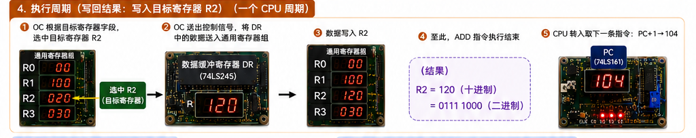

#### 3. 总体流程图
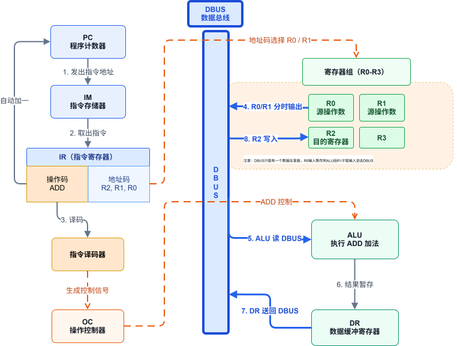

### 5.2.5 STO 指令的指令周期

STO 是一条 **RS 型指令**（寄存器-存储器），需要先访问**指存**取指令，再访问**数存**存数据，其指令周期由 **3 个 CPU 周期** 组成：

| 阶段 | 占用 | 任务 |
| :--- | :--- | :--- |
| **取指周期** | 1 个 CPU 周期 | 取指令、PC+1、译码 |
| **执行周期** | 2 个 CPU 周期 | 间址（送地址）+ 存数（将 R2 数据写入数存） |

>  **为什么执行周期要 2 个 CPU 周期？** 因为 DBUS 上需要**分时**完成两件事：先传地址，再传数据，不能同时进行。

---

#### 1. 取指周期

> 目标：从指存中取出 STO 指令（流程与前述取指完全相同故省略）。

#### 2. 执行周期

> 目标：将通用寄存器 R2 中的数据 345，存入数存 7 号单元。

#####  第一个 CPU 周期 — 间址阶段（传地址）

1. **IR → DBUS**：OC 打开 IR 输出三态门，将指令中的直接地址码 `7` 放到 DBUS 上
2. **DBUS → AR**：OC 将地址码 7 装入数存地址寄存器 AR

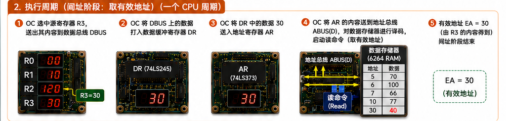

#####  第二个 CPU 周期 — 存数阶段（传数据）

3. **R2 → DR**：OC 根据 IR 中源寄存器字段选中 **R2**，将其内容 `345` 送入缓冲寄存器 DR
4. **DR → DBUS**：OC 打开 DR 输出三态门，将数据 `345` 放到数据总线 DBUS 上
5. **DBUS → [7]**：OC 发出写命令，将 DBUS 上的数据 `345` 写入数存 7 号单元
   - 7 号单元的内容被更新为 `345`（原数据被冲掉）→ 执行结束 ✅

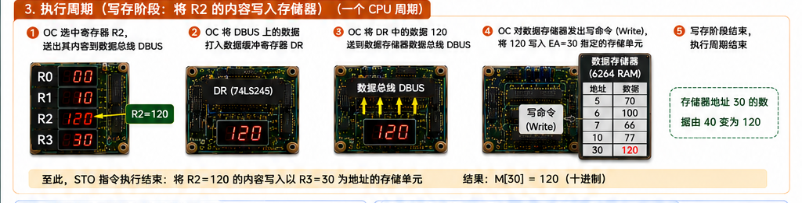

#### 3. 总体流程图
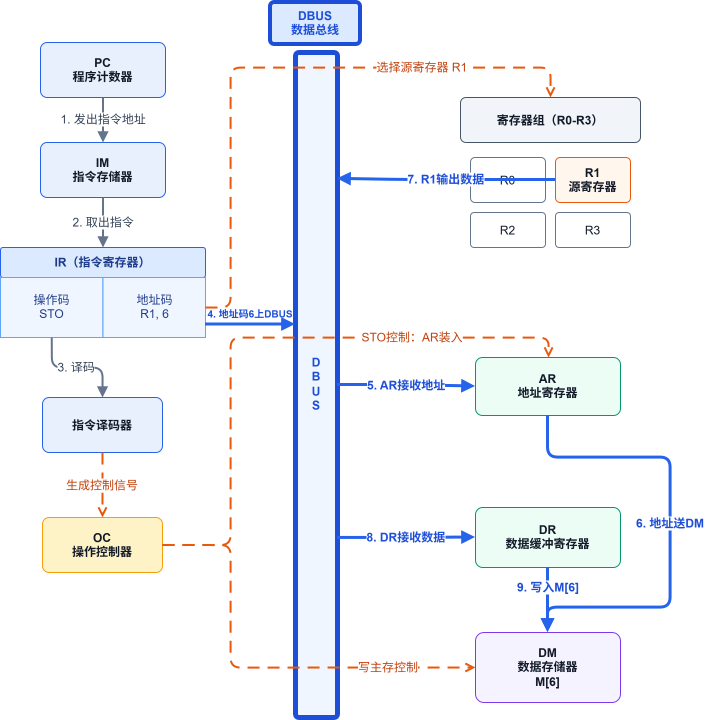

### 5.2.6 JMP 指令的指令周期

JMP 是一条 **无条件转移指令**（或 **J 型指令**），其指令周期由 **2 个 CPU 周期** 组成：

| 阶段 | 占用 | 任务 |
| :--- | :--- | :--- |
| **取指周期** | 1 个 CPU 周期 | 取指令、PC+1、译码 |
| **执行周期** | 1 个 CPU 周期 | 修改 PC（将指令中的地址码直接写入 PC） |

---

#### 1. 取指周期

> 目标：从指存中取出 JMP 指令（流程与前述取指完全相同故省略）。

#### 2. 执行周期

> 目标：将指令中的地址码（109）写入 PC，实现无条件跳转到 109 号地址。

#####  步骤一 — 读取地址码

1. **IR → DBUS**：OC 打开 IR 输出三态门，将指令中的直接地址码 `109` 放到 DBUS 上

#####  步骤二 — 修改 PC

2. **DBUS → PC**：OC 将 DBUS 上的数据 109 直接写入 **PC**
   - PC 的内容由 `105` → `109` → 执行结束 ✅

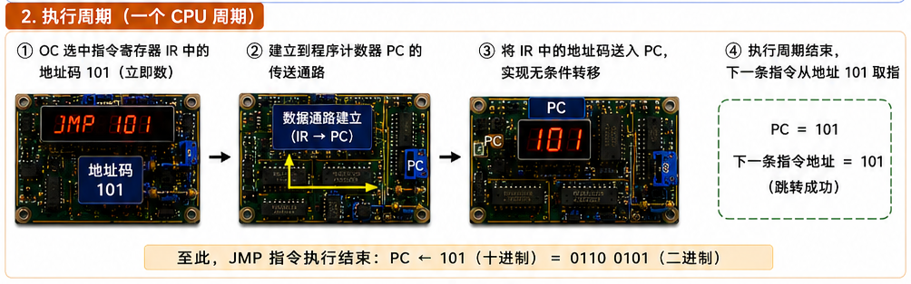

#### 3. 总体流程图
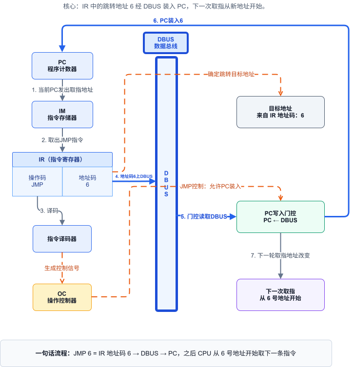

### 5.2.7 用方框图语言表示指令周期

将前面五条典型指令加以归纳，用方框图语言表示的指令周期如下图所示：

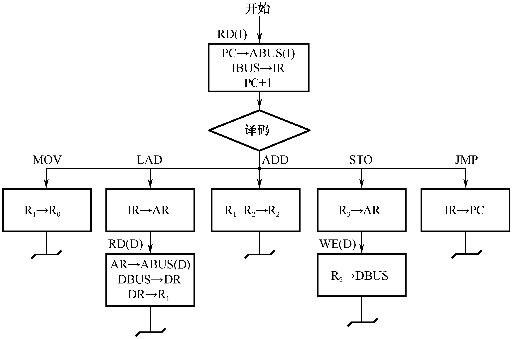

####  公操作（～）

方框图中的 **"～"符号** 称为**公操作符号**，表示一条指令已经执行完毕，转入指令结束前的公操作。

> **公操作**：一条指令执行完毕后，CPU 所进行的一些操作，主要是对**外围设备请求**的处理，如**中断处理**、**通道处理**等。

*   如果外围设备**没有**向 CPU 请求交换数据 → CPU 转向指存**取下一条指令**
*   如果外围设备**有**请求 → CPU 先处理中断/通道请求，再继续取指

>  由于所有指令的取指周期完全一样，因此**取指令本身也可认为是公操作** —— 一条指令执行结束后，如果没有外设请求，CPU 一定转入"取指令"操作。